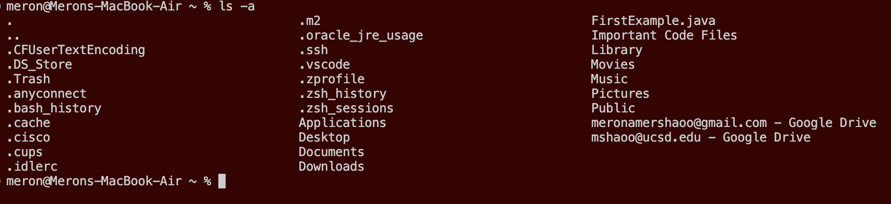

# Lab Report 1: Remote Access and FileSystem

Follow the steps below in order to be able to log in to course-specific accounts such as **ieng6** and be able to remotely access them and run commands through them.

---

## Step One: Installing Virtual Studio Code On Your Device

(Skip this step if you already have VScode on your device or you are planning to use lab computers, with the application pre-installed.)

To install VScode visit [https://code.visualstudio.com](https://code.visualstudio.com) and click the big blue Download button on the top right of the page. Follow the step provided and down a version of VScode suitable for your operating system.

After running through all the steps and installing the application, open up the VSCode application and you should have a window that looks similar to this image below.(The window you opened up might have a different color or formatting but that is due to the version you downloaded or was changed due to personal preference.)

## Step Two: Remotely Connecting to Server

**Note:** If you have a Windows OS then you will need to install **git** to your device by visiting this [link](https://gitforwindows.org).

To get started with remotely connecting to a server, you need to open up VScode and opening a terminal. (To open a terminal, use the Terminal → New Terminal menu option)

Now to access *ssh*, type in the command below into your terminal and press Enter or Return. (Make sure to not type the *$* in your terminal.)

  $ ssh cs15lsp23xx@ieng6.ucsd.edu
  
 The **cs15lsp23xx** is going to be your course specific account that can be found by following the directions on this [link](https://sdacs.ucsd.edu/~icc/index.php).
 
 After running this command, you should get a prompt confirming your choice to establish a connection with the server. Type *yes* into the terminal and then type in the password you created for your course-specific account (Yes, the password is invisible. It is for secruity purposes). Something similar to this should be printed out.
 
 
 
 **Note:** My terminal says *mshaoo* instead of my course-specific account because a problem was occurring with my course-specific account that wasn't allowing me to sign in.
 
## Step Three: Running Commands
 
 Now you are remotely connected to a computer in the CSE basement and are ready to run any commands on this computer through this connection. Using the *cd, ls, pwd, mkdir, and cp* commands, run some commands in your terminal and see what result gets printed out.
 
 Some example commands to try out:
 * cd ~
 * cd
 * ls -lat
 * ls -a

### Example of using commands ls -a and ls -lat on Remote Server

**Note:** You can also log out of the remote server by typing and running *exit* in your terminal. Now you can try the same commands as above on your computer through the terminal and see what the results are.

### Example of using command ls -a on your OWN Computer

