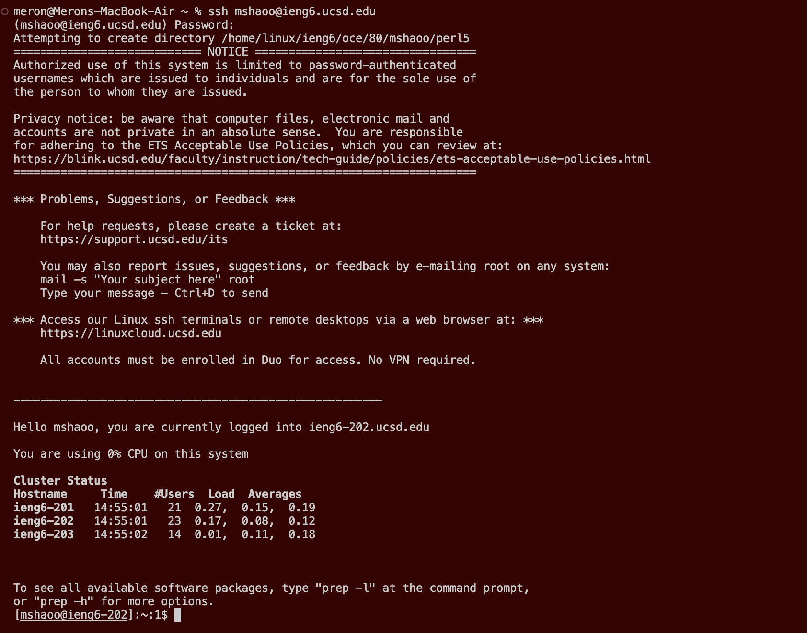
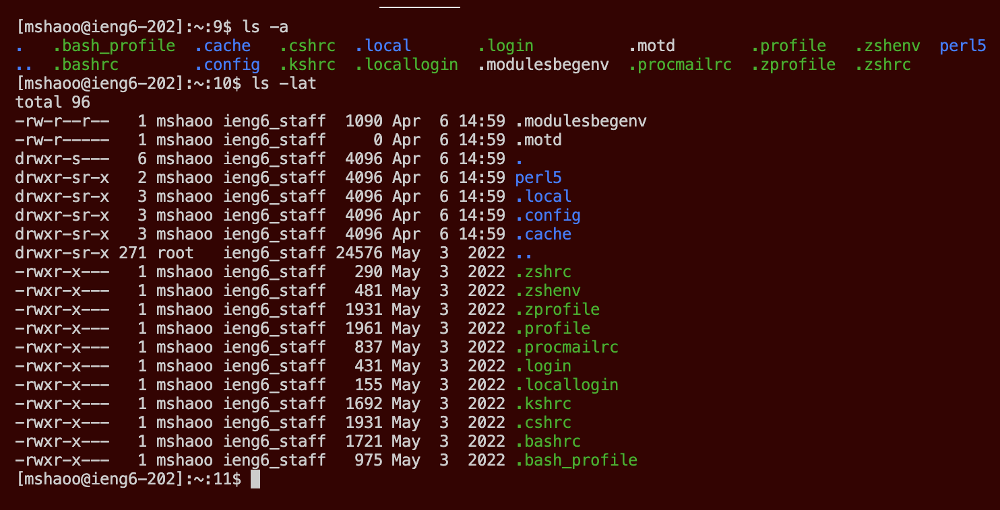

# Lab Report 1: Remote Access and FileSystem

Follow the steps below in order to be able to log in to course-specific accounts such as `ieng6` and be able to remotely access them and run commands through them.

---

## Step One: Installing Virtual Studio Code On Your Device

(Skip this step if you already have VScode on your device or you are planning to use lab computers, with the application pre-installed.)

To install VScode visit [https://code.visualstudio.com](https://code.visualstudio.com) and click the big blue Download button on the top right of the page. Follow the step provided and down a version of VScode suitable for your operating system.

After running through all the steps and installing the application, open up the VSCode application and you should have a window that looks similar to this image below.(The window you opened up might have a different color or formatting but that is due to the version you downloaded or was changed due to personal preference.)

## Step Two: Remotely Connecting to Server

**Note:** If you have a Windows OS then you will need to install **git** to your device by visiting this [link](https://gitforwindows.org).

To get started with remotely connecting to a server, you need to open up VScode and opening a terminal. (To open a terminal, use the Terminal → New Terminal menu option)

Now to access `ssh`, type in the command below into your terminal and press Enter or Return. (Make sure to not type the `$` in your terminal.)

  `$ ssh cs15lsp23xx@ieng6.ucsd.edu`
  
 The `cs15lsp23xx` is going to be your course specific account that can be found by following the directions on this [link](https://sdacs.ucsd.edu/~icc/index.php).
 
 After running this command, you should get a prompt confirming your choice to establish a connection with the server. Type `yes` into the terminal and then type in the password you created for your course-specific account (Yes, the password is invisible. It is for secruity purposes). Something similar to this should be printed out.
 
 
 
 **Note:** My terminal says `mshaoo` instead of my course-specific account because a problem was occurring with my course-specific account that wasn't allowing me to sign in.
 
## Step Three: Running Commands
 
 Now you are remotely connected to a computer in the CSE basement and are ready to run any commands on this computer through this connection. Using the `cd`, `ls`, `pwd`, `mkdir`, and `cp` commands, run some commands in your terminal and see what result gets printed out.
 
 Some example commands to try out:
 * `pwd` - prints out the entire current working directory from the root directory
 * `cd` - makes you able to change directories by typing the name of the directory you want to switch to after the command.
 * `ls -lat` - list various information about the latest files accessed on the device(i.e. # of visits, data accessed, size of file, etc.) 
 * `ls -a` - lists all files on device

### Example of using commands `ls -a` and `ls -lat` on Remote Server

(Here the `ls -a` lists out all the files in the remote server and the `ls -lat` list various information about the latest files accessed on the remote server.)

**Note:** You can also log out of the remote server by typing and running `exit` in your terminal. Now you can try the same commands as above on your computer through the terminal and see what the results are.

### Example of using command `ls -a` on your OWN Computer

(Here the `ls -a` lists out all the files on my computer.)
