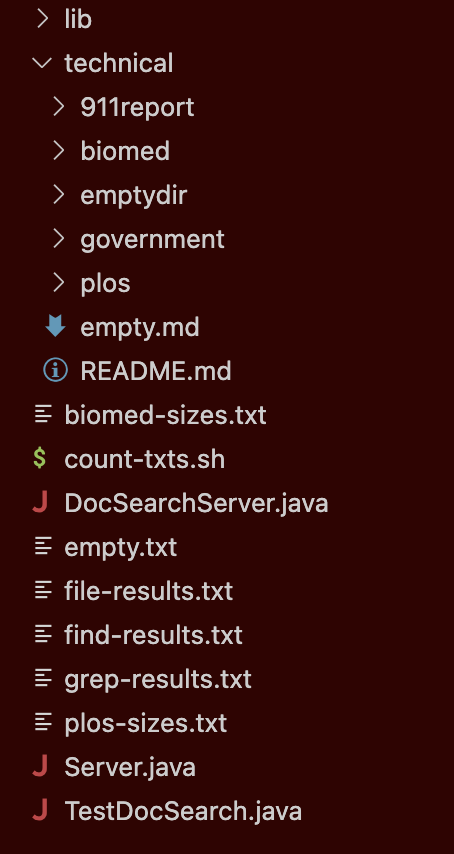
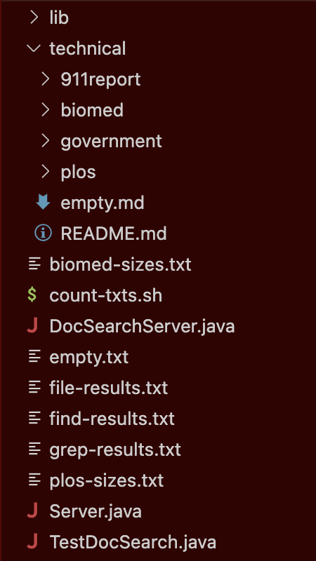

# Lab Report 3 - Researching Commands

In this lab report, you will learn about using the `find` command used in the command-line and some options that can be used with this command.

---
**Sources Used:** [ChatGPT](https://chat.openai.com) & [SS64](https://ss64.com/osx/find.html)

**Chat GPT Prompts & Responses:
1. Prompt: *'find command-line options using the command "find"'*

The "find" command is a powerful utility used to search for files and directories in a given directory hierarchy based on different criteria. Here are some common command-line options you can use with the "find" command:

1. `-name`: This option allows you to search for files based on their name. For example, to find all files named "file.txt" in the current directory and its subdirectories, you can use the following command: `find . -name file.txt`.

2. `-type`: This option allows you to search for files based on their type. For example, to find all directories in the current directory and its subdirectories, you can use the following command: `find . -type d`.

3. `-mtime`: This option allows you to search for files based on their modification time. For example, to find all files that have been modified in the last 7 days in the current directory and its subdirectories, you can use the following command: `find . -mtime -7`.

4. `-size`: This option allows you to search for files based on their size. For example, to find all files that are larger than 1MB in the current directory and its subdirectories, you can use the following command: `find . -size +1M`.

5. `-exec`: This option allows you to execute a command on each file that matches the search criteria. For example, to delete all files with the ".log" extension in the current directory and its subdirectories, you can use the following command: `find . -name "*.log" -exec rm {} \;`.

6. To find all files in the home directory and its subdirectories that have the word "example" in their name, you can use the following command:

   `find ~/ -name "*example*"`

7. To find all empty files in the current directory and its subdirectories, you can use the following command:

   `find . -type f -empty`

8. To find all files with the extension ".txt" or ".md" in the current directory and its subdirectories, you can use the following command:

   `find . \( -name "*.txt" -o -name "*.md" \)`

9. To find all directories in the current directory and its subdirectories that have not been modified in the last 30 days, you can use the following command:

   `find . -type d -mtime +30`

10. To find all files owned by a specific user in the current directory and its subdirectories, you can use the following command:

    `find . -user username`

11. To find all files that were modified exactly 7 days ago in the current directory and its subdirectories, you can use the following command:

    `find . -type f -mtime 7`

These are just a few examples to give you an idea of how to use the "find" command with different options. There are many more options available, and you can combine them to create more complex searches based on your requirements.

These are just a few examples of the command-line options you can use with the "find" command. To learn more about the different options and how to use them, you can refer to the "find" command's manual pages by typing `man find` in the terminal.

2. Prompt: *give me different command line commands using find and  -exec that delete only in the working directory*

Sure! Here are some examples of command line commands that use the "find" command with the "-exec" option to delete files only in the current working directory (i.e., the directory where you are currently located in the command line interface):

1. Delete all files with a .log extension in the current working directory:
```Java
find . -maxdepth 1 -name "*.log" -type f -exec rm {} \;
```

2. Delete all files with a .bak extension in the current working directory and its subdirectories:
```Java
find . -name "*.bak" -type f -exec rm {} \;
```

3. Delete all empty directories in the current working directory:
```Java
find . -type d -empty -exec rmdir {} \;
```

In these examples, the "-maxdepth 1" option is used to limit the search to only the current working directory (i.e., it does not search in subdirectories), or the search is not limited at all (in the case of empty directories). 

Again, it's important to be cautious when using the "find" command with the "-exec" option to delete files, as there is no undo function for deleting files from the command line. Always double-check the files you are about to delete before running the command.

---

## Part One: Command `find` With `-name` Option

Below is the command-line command used to search and find all the files based on the name within the current working directory and the output of resulting from using the command.

**Input & Output:**

```Java
meron@Merons-MacBook-Air technical % find . -name "*.md"
./README.md
./empty.md
```

Using the `find` command with this option allows me to find all the files of a certain file type. This can be helpful is aiding me to quickly locate what file I may be looking for. In this case, using the command allowed me to find all the files with the type `.md` in my current working directory, which were only two files.

**Input & Output:**

```Java
meron@Merons-MacBook-Air technical % find . -name "*chapter*"
./911report/chapter-13.4.txt
./911report/chapter-13.5.txt
./911report/chapter-13.1.txt
./911report/chapter-13.2.txt
./911report/chapter-13.3.txt
./911report/chapter-3.txt
./911report/chapter-2.txt
./911report/chapter-1.txt
./911report/chapter-5.txt
./911report/chapter-6.txt
./911report/chapter-7.txt
./911report/chapter-9.txt
./911report/chapter-8.txt
./911report/chapter-12.txt
./911report/chapter-10.txt
./911report/chapter-11.txt
```

The `find` command with the option above uses the same method of searching the current working directory for all the files with the same name, but, in the case of this command-line, using stars before and after a specific word will indictate that you want to find all the files that contain that word as part of their name. In this case, I searched for all the files that have the word **chapter** and 16 files were returned as a result.

## Part Two: Command `find` With `-type` Option

Below is the command-line command used to search and find all the files based on the filetype within the current working directory and the output of resulting from using the command.

**Input & Output:**

```Java
meron@Merons-MacBook-Air technical % find . -type d
.
./government
./government/About_LSC
./government/Env_Prot_Agen
./government/Alcohol_Problems
./government/Gen_Account_Office
./government/Post_Rate_Comm
./government/Media
./plos
./biomed
./911report
```

Using the `find` command with this option allows me to find all the files of the current directory. This can be helpful is aiding me to quickly locate what file I may be looking for. In this case, using the command allowed me to find all the files within my current working directory.

**Input & Output:**

```Java
meron@Merons-MacBook-Air technical % find . -type f -empty
./empty.md
```

Here the `-type` option used in the `find` command searches for the file individually as compared to the previous command-line which searched through the directories. In this case, the command-line searched for all the files that were empty, which returned a single file that had no text or code.

## Part Three: Command `find` With `-exec` Option

Below is the command-line command used to search and find all the files based on the search citeria and it executes a given command in the file(s).

**Input & Output:**

```Java
meron@Merons-MacBook-Air docsearch % find technical  -type d -empty -exec rmdir {} +
```

**Before:**


**After:**


Using the `find` command with this option first searches for all the files meeting the search citeria, in this case they just need to be an empty directory. Then through the `-exec` option we can execute the remove directory command. In this case the `emptydir` directory was deleted from the `/technical` directory. This can be helpful is aiding me to quickly deleting unwanted directories or accessing and using the files within such directories.

**Input & Output:**

```Java
meron@Merons-MacBook-Air technical % find . -maxdepth 1 -name "*.md" -type f 
-exec rm {} \;

```
**Before:**


**After:**


Here the `-type` option used in the `find` command searches for the file individually with the name containing `.md` in the current working directory and removes it. In this case, the terminal doesn't return anything but still executes the remove command, `rm`, and removes all the `.md` files in the current working directory, which were two in my case.

## Part Four: Command `find` With `-mtime` Option

Below is the command-line command used to search and find all the files based on the the time since the files have been modified.

**Input & Output:**

```Java
meron@Merons-MacBook-Air technical % find . -mtime -7
.
./911report/chapter-1.txt
```

**Input & Output:**

```Java
meron@Merons-MacBook-Air technical % find . -mtime +7
.
./plos/journal.pbio.0020052.txt
./plos/pmed.0020148.txt
./plos/pmed.0020160.txt
./plos/pmed.0010048.txt
./plos/pmed.0010060.txt
./plos/journal.pbio.0030137.txt
./plos/journal.pbio.0030136.txt
./plos/pmed.0010061.txt
./plos/pmed.0010049.txt
./plos/pmed.0020161.txt
./plos/journal.pbio.0020127.txt
./plos/pmed.0020149.txt
./plos/journal.pbio.0020133.txt
./plos/pmed.0020015.txt
./plos/journal.pbio.0020053.txt
./plos/journal.pbio.0020047.txt
./plos/pmed.0020203.txt
...
```

Using the `find` command with this option searches for all the files based on the modification time given by the command, in this case 7 days. The only difference between the two command is the `-7` and `+7`. The plus and minus differientiate between if the files have not been modified versus have been modified within the modification date, respectively. This can be helpful is aiding me to quickly to narrow down where work has been done on the files and which files are left untouched. In the case of the second use of the command with the `-mtime` option, for the sake of this site, I inputed the output as `...` because there are way too many files to even fit on this page.
