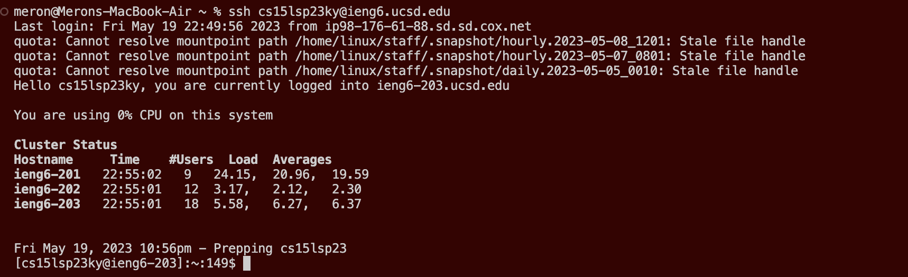
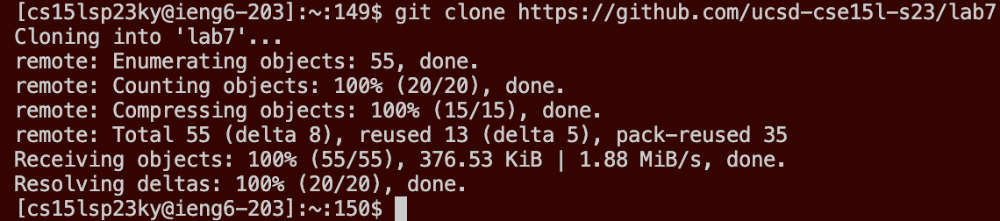
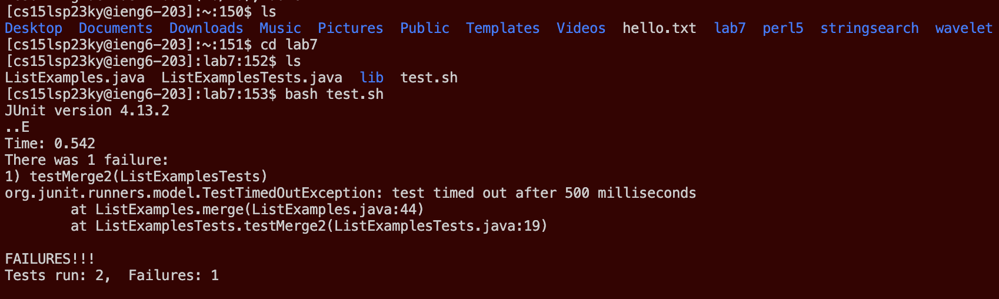
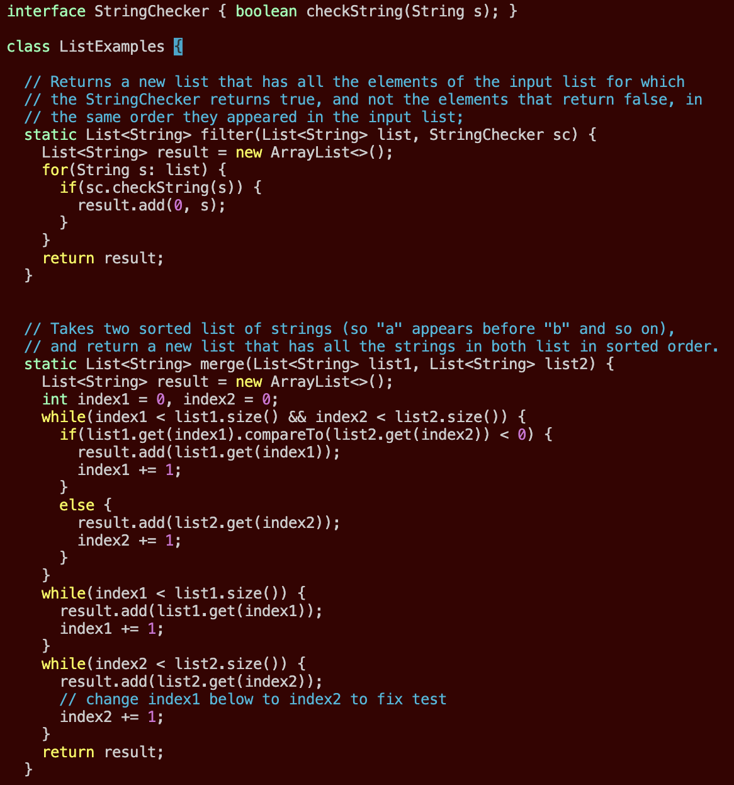
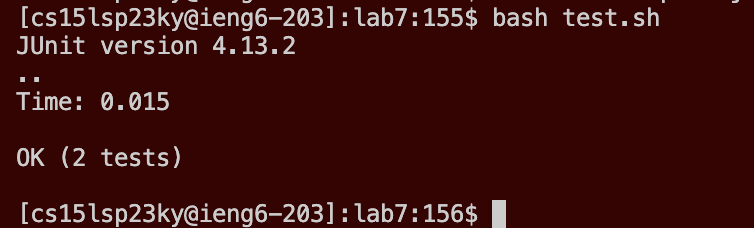
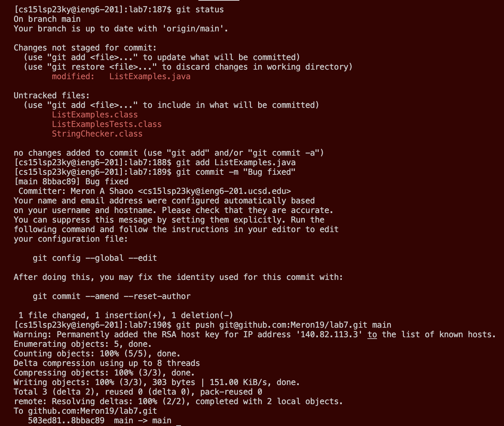

# Lab Report 4 - Doing it All from the Command Line
In this lab report, you will learn how to be able to do all the thing done on VSCode, but through the command line.

---

## Step 1: Logging into Remote Server

**Keys Pressed:** `<up><up><enter>`

Since the `ssh cs15lsp23ky@ieng6.ucsd.edu` command was 2 up arrows in my terminal search history, I was able to access and enter into `ssh` mode and login to my `ieng6` remote server account.

## Step 2: Cloning Repository

**Keys Pressed:** `git clone https://github.com/ucsd-cse15l-s23/lab7 <enter>` 

Using the `git clone` command clones an existing repository, which is represented by the given GitHub link, and makes it into a directory inside the current device. In this case, the current device is the remote `ieng6` server.

## Step 3: Running Incorrect Tests

**Keys Pressed:** `ls<enter>cd lab7<enter>ls<enter>bash test.sh<enter>`

Various commands were used in this step just to be able to run the tests and demonstrate that they fail. First, in order to find the directory that was added, I used the `ls` command and noticed that `lab7` directory was added. Then I used the `cd` command change my current working directory to `lab7`. After that, I used the `ls` command again to see the available files within the `lab7` directory and noticed that there was a `.sh` shell command file that compiled and ran the tests. I typed in `bash test.sh` into the terminal and ran the tests.

## Step 4: Editing the File Through the Command Line

**Keys Pressed:** `vim ListExamples.java<enter>/index1<enter>nnnnnnnnn<right><right><right><right><right>r2:wq<enter>`

On this step, I first entered by typing `vim` into the terminal followed by the file that I wanted to be opened on `vim`, which was the `ListExamples.java` in this case. After running this command, I used `/` to enter into Search Mode on `vim` then I typed in what I needed to change, which was a single occurance of `index1` towards the bottom of the file. To navigate to this specific `index1`, I pressed `n`, which when in Search Mode sends the cursor to the next occurance of the search term, 9 times until I found when the change needed to be made. Next, I moved 5 spaces to the right using the right arrow key and replaced the `1` to `2` in `index1` using the `r2` command. Typing `r` and another character after it changes the current character that the cursor is on to that charcater next to the `r`. After completing my changes, I entered `:wq` to save and quit `vim`.

## Step 5: Re-Running the Tests

**Keys Pressed:** `<up><up><enter>`

Since the `bash test.sh` command was 2 up arrows in my terminal search history, I was able to access it and re-run the bash command to run the tests again. After making the edits in `vim`, the two tests now both pass.

## Step 6: Committing & Pushing The Edit

**Keys Pressed:** `git status<enter>git add ListExamples.java<enter>git commit -m "Bug fixed"<enter>git push git@github.com:Meron19/lab7.git main<enter>`

On this step, there were multiple commands that were passed in order to commit and push the changes made on the file through `vim` mode to the actual repository. The first step is to pull up the list of files that were changed through the `git status`. Then, I chose the file that I edited, which was the `ListExamples.java` file and added it to the list of files that can be committed through the `git add` command. Now, all that was left was to actually commit the changes to my forked respository through the `git command` and include whatever message I wanted. Lastly, I pushed the commit through the `git push` command and the `ssh` URL.
