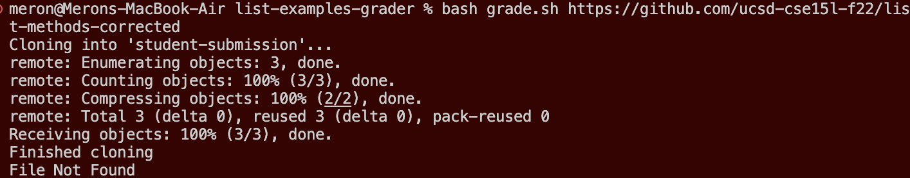
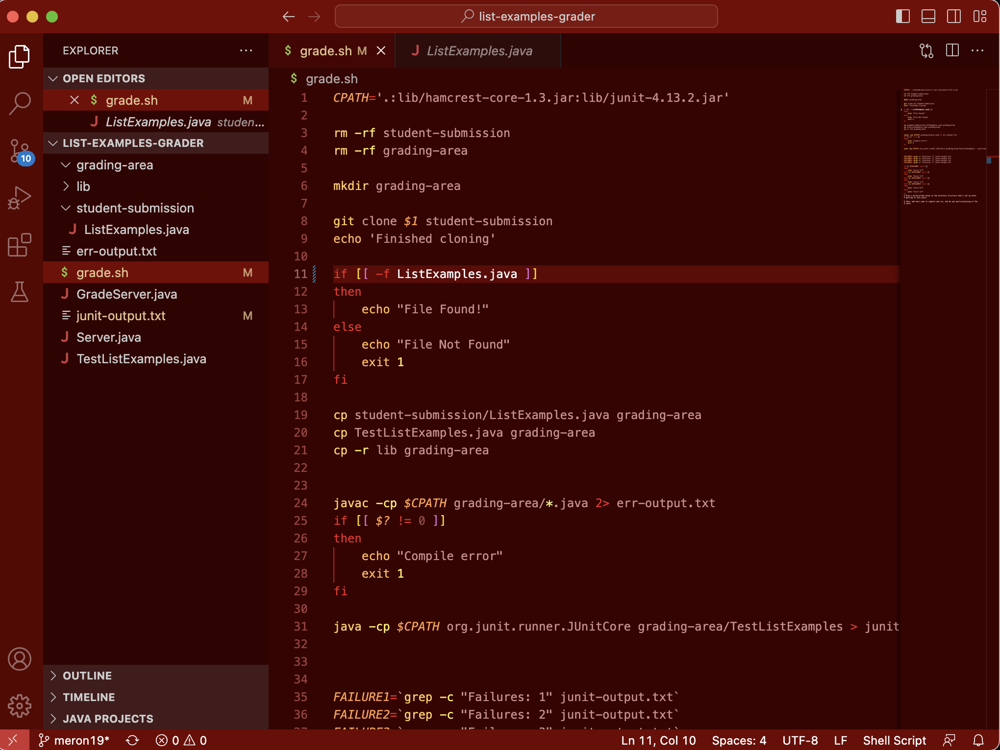
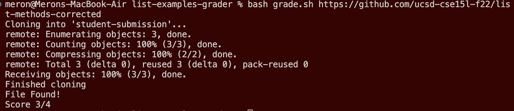

# Lab Report 5 - Debugging Scenario
In this lab, you see a scenario of a debugging situation between a student and a TA.

---

## Part One: Student Post & TA Response

### Student Post:
*What environment are you using (computer, operating system, web browser, terminal/editor, and so on)?*

I am using the terminal on VS Code via my MacBook to run a `bash` script that mimics Gradescope's autograder. The `bash` script is from week six lab call `List-Examples-Grader`.

*Detail the symptom you're seeing. Be specific; include both what you're seeing and what you expected to see instead. Screenshots are great, copy-pasted terminal output is also great. Avoid saying “it doesn't work”.*

The `bash` script called `grade.sh` takes in a repository consistenting of code for the `ListExamples.java` and compiles and runs `JUnit` tests on `ListExamples.java`. However, when running the command `bash grade.sh https://github.com/ucsd-cse15l-f22/list-methods-corrected` in my terminal, I get an output of that says the file has not been found as seen in the image below.



*Detail the failure-inducing input and context. That might mean any or all of the command you're running, a test case, command-line arguments, working directory, even the last few commands you ran. Do your best to provide as much context as you can.*

My current working directory is `/Users/meron/Documents/GitHub/list-examples-grader` so I know it isn't a problem with the directories and the only command I am running in my command line is `bash grade.sh` with the link. Below I a picture of how VS Code looks with my files and my `grade.sh`. I have a feeling that my bug is in line 11 with the conditional, but I don't know what the issue could be.



### TA Response:

Looking at the image of your VS Code, I noticed that your `ListExamples.java` is within a folder called `student-submission`. However, when looking at your code for `grade.sh`, your coditional for line 11 seems to be searching for a file in `LIST-EXAMPLES-GRADER` called `ListExamples.java`. The problem, here, is that the conditional seems to be searching only within the folder `LIST-EXAMPLES-GRADER` and not within the folders that are also within `LIST-EXAMPLES-GRADER` such as  `student-submission`. Since `ListExample.java` is in the `student-submission` folder, then try adding adding `student-submission/` in front of the `ListExample.java` on line 11 in your conditional.

### Student Result:
Thank you. I finally got it to work with your help. All I needed to do was add the extra `student-submission/` in front of the `ListExample.java` on line 11. This is the result that I got after fixing my bug.



### Java File & Bash Script:

**Bash Script:**
```java
CPATH='.:lib/hamcrest-core-1.3.jar:lib/junit-4.13.2.jar'

rm -rf student-submission
rm -rf grading-area

mkdir grading-area

git clone $1 student-submission
echo 'Finished cloning'

if [[ -f student-submission/ListExamples.java ]]
then
    echo "File Found!"
else
    echo "File Not Found"
    exit 1
fi

cp student-submission/ListExamples.java grading-area
cp TestListExamples.java grading-area
cp -r lib grading-area


javac -cp $CPATH grading-area/*.java 2> err-output.txt
if [[ $? != 0 ]]
then
    echo "Compile error"
    exit 1
fi

java -cp $CPATH org.junit.runner.JUnitCore grading-area/TestListExamples > junit-output.txt


FAILURE1=`grep -c "Failures: 1" junit-output.txt`
FAILURE2=`grep -c "Failures: 2" junit-output.txt`
FAILURE3=`grep -c "Failures: 3" junit-output.txt`
FAILURE4=`grep -c "Failures: 4" junit-output.txt`

if [[ $FAILURE1 -ne 0 ]]
then 
    echo "Score 3/4"
elif [[ $FAILURE2 -ne 0 ]]
then
    echo "Score 2/4"
elif [[ $FAILURE3 -ne 0 ]]
then
    echo "Score 1/4"
elif [[ $FAILURE4 -ne 0 ]]
then
    echo "Score 0/4"
else
    echo "Score 4/4"
fi
# Draw a picture/take notes on the directory structure that's set up after
# getting to this point

# Then, add here code to compile and run, and do any post-processing of the
# tests
```

**Java File:**
```java
import java.util.ArrayList;
import java.util.List;

interface StringChecker { boolean checkString(String s); }

class ListExamples {

  // Returns a new list that has all the elements of the input list for which
  // the StringChecker returns true, and not the elements that return false, in
  // the same order they appeared in the input list;
  static List<String> filter(List<String> list, StringChecker sc) {
    List<String> result = new ArrayList<>();
    for(String s: list) {
      if(sc.checkString(s)) {
        result.add(s);
      }
    }
    return result;
  }


  // Takes two sorted list of strings (so "a" appears before "b" and so on),
  // and return a new list that has all the strings in both list in sorted order.
  static List<String> merge(List<String> list1, List<String> list2) {
    List<String> result = new ArrayList<>();
    int index1 = 0, index2 = 0;
    while(index1 < list1.size() && index2 < list2.size()) {
      if(list1.get(index1).compareTo(list2.get(index2)) < 0) {
        result.add(list1.get(index1));
        index1 += 1;
      }
      else {
        result.add(list2.get(index2));
        index2 += 1;
      }
    }
    while(index1 < list1.size()) {
      result.add(list1.get(index1));
      index1 += 1;
    }
    while(index2 < list2.size()) {
      result.add(list2.get(index2));
      index2 += 1;
    }
    return result;
  }
}
```

## Part Two: Reflection

Throughout the second half of this quarter, I learned many thing, but the main thing that I will take away is probably going to be how to use `vim`. `vim` is a really helpful program to edit code or files when on a remote server. In lecture and during lab, we learned many little techniques that allow our usage of `vim` to be more fluid, but there is still a lot that can be learned when using this program and similar programs in the future. Because I was able to learn about this program through this course, I plan to research more on my own and get better at using `vim` more fluently. Learning how to use `vim` better will be helpful in future courses like CSE 30.
